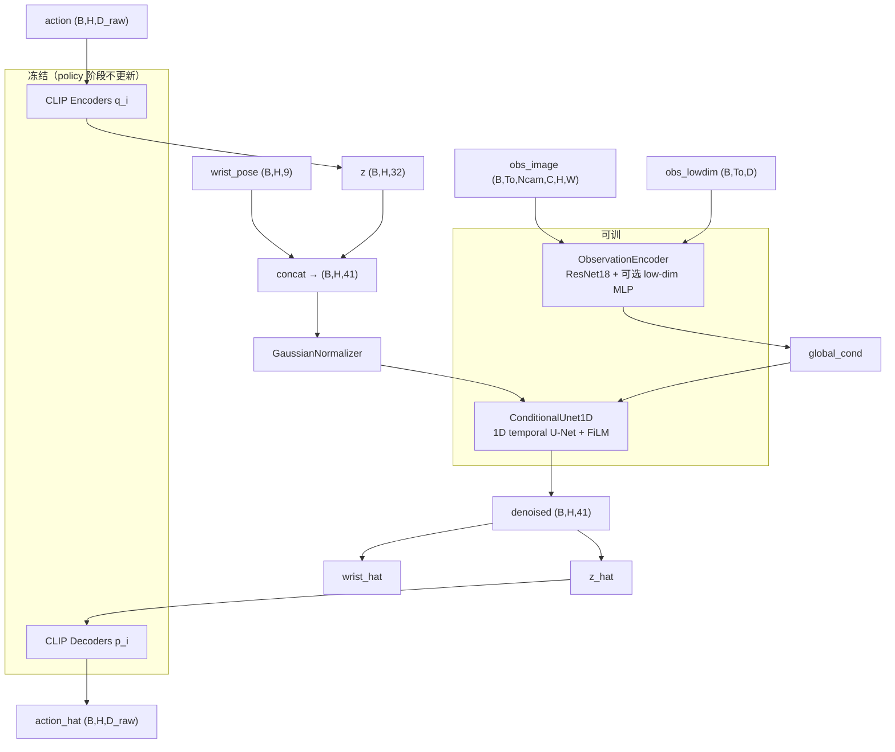

# Method：CLIP 跨本体动作空间 + Latent Diffusion Policy

本文档说明当前仓库里 **RobotCLIP（encoder / decoder）** 与 **Diffusion Policy** 各自处理什么量、输出什么、以及 arm / wrist / hand 在代码中的分工。

---

## 1. 总览

```text
Retargeting 对齐数据 (.npy / 未来 .npz)
        │
        ├─ mano 189-d ──► q_mano ──► z ∈ R^32 ──┐
        ├─ xhand 12-d ──► q_xhand ──► z ────────┤  对比学习对齐的共享 latent
        └─ g2 1-d ──────► q_g2 ────► z ──────────┘
                              │
                              │  policy 阶段：冻结 q, p
                              ▼
        wrist_pose 9-d (不进 CLIP) ──► 与 z 拼接 ──► U-Net 扩散 (B, H, 32+9)
                              │
                              ▼
                    DDIM 去噪 → z_hat + wrist_hat
                              │
                              ▼
                    冻结 p_j(z_hat) → 物理 action (12-d / 1-d / 189-d)
```

| 部位 | 在数据里的字段 | 是否进 CLIP | 是否进 Diffusion U-Net | 含义 |
|---|---|---|---|---|
| **Hand（手指/灵巧手）** | `action`：`mano` 189 / `xhand` 12 / `g2` 1 | 是（经 \(q_i\) 压成 32 维） | 是（扩散 **latent** 部分） | 手指关节、人手局部姿态、夹爪开合 |
| **Wrist / EEF（腕部/末端位姿）** | `wrist_pose`：9（xyz + 6D 旋转） | **否** | 是（与 latent **直接拼接** 扩散） | 机械臂末端在任务空间的位姿 |
| **Arm（机械臂关节）** | 当前代码 **无单独字段** | 否 | 否 | 未扩散 7 轴关节角；臂的位置由 `wrist_pose` 在笛卡尔空间间接表示 |

> **说明**：`retargeting/` 流水线目前只对齐 **人手 ↔ XHand 12 关节 ↔ G2 夹爪**，不包含 xArm7 全臂轨迹。Policy 数据里的 `wrist_pose` 需由你后续采集/标定写入 `.npz`。

---

## 2. RobotCLIP：Encoder / Decoder 输入与输出

### 2.1 三种模态的物理含义

配置见 `config/modalities/mano_xhand_g2.yaml`：

| 模态 key | 维度 | 物理量 | 对应 retargeting `.npy` key |
|---|---|---|---|
| `mano` | 189 | 21 关节局部变换（每关节 6D 旋转 + 3D 平移） | `local_representation` |
| `xhand` | 12 | XHand 手指关节角（rad） | `xhand_angles` |
| `g2` | 1 | 夹爪开合 \(\theta \in [0,1]\)（0 闭 / 1 开） | `g2_width` |

人手 189 维来自 `retargeting/retargeting/human_repr.py`：`21 × 9 = 189`，每关节 9 维 = 6D rotation + 3D translation（相对父关节）。

### 2.2 网络结构

每个模态一对 **MLP Encoder** \(q_i\) 和 **MLP Decoder** \(p_i\)，共享 embedding 维数 `embedding_dim = 32`：

```50:68:robot_clip/robot_clip/model.py
        for modality, params in self.modalities.items():
            self.encoders[modality] = ModalityEncoder(
                params.input_dim, 
                params.encoder_hidden_dims, 
                config.model.embedding_dim,
                dropout_rate=config.model.encoder_dropout
            )
            self.decoders[modality] = ModalityDecoder(
                config.model.embedding_dim, 
                params.decoder_hidden_dims, 
                params.input_dim,
                dropout_rate=config.model.decoder_dropout
            )

    def encode(self, inputs: Dict[str, torch.Tensor]) -> Dict[str, torch.Tensor]:
        return {modality: self.encoders[modality](inputs[modality]) for modality in inputs}

    def decode(self, embeddings: Dict[str, torch.Tensor]) -> Dict[str, torch.Tensor]:
        return {modality: self.decoders[modality](embeddings[modality]) for modality in embeddings}
```

**Encoder 输出**：每个模态一个 **32 维向量** \(z_i = q_i(\hat{x}_i)\)，其中 \(\hat{x}_i\) 是 CLIP 训练集 mean/std 归一化后的动作。

**Decoder 输出**：在 **归一化空间** 重建 \(\tilde{x}_i = p_i(z_i)\)，再 `denormalize` 回到物理单位（关节角 rad、夹爪 [0,1]、人手 189 维）。

### 2.3 训练时的前向（自重建）

```70:73:robot_clip/robot_clip/model.py
    def forward(self, inputs: Dict[str, torch.Tensor]):
        embeddings = self.encode(inputs)
        reconstructions = self.decode(embeddings)
        return embeddings, reconstructions
```

- `embeddings["mano"]`：`(B, 32)`
- `reconstructions["mano"]`：`(B, 189)`，与输入同形状的归一化重建

### 2.4 验证时的跨模态重建（Cross-Reconstruction）

同一帧的 **mano embedding** 可以喂给 **任意** decoder，用于评估跨本体 retargeting：

```114:120:robot_clip/robot_clip/model.py
        for source_modality in self.modalities:
            source_embedding = embeddings[source_modality]
            
            for target_modality in self.modalities:
                # Use source modality's embedding to reconstruct target modality
                cross_reconstruction = self.decoders[target_modality](source_embedding)
                cross_loss = F.mse_loss(inputs[target_modality], cross_reconstruction)
```

推理脚本 `scripts/infer_aligned.py` 实现了三种 decode 路径：

```98:106:robot_clip/scripts/infer_aligned.py
    with torch.no_grad():
        embeddings = model.encode(batch)
        self_norm = model.decode(embeddings)
        from_mano_norm = _decode_from(model, embeddings["mano"], names)
        from_xhand_norm = _decode_from(model, embeddings["xhand"], names)

    self_recon = denormalize_data(_as_numpy(self_norm), norm)
    from_mano = denormalize_data(_as_numpy(from_mano_norm), norm)
    from_xhand = denormalize_data(_as_numpy(from_xhand_norm), norm)
```

| 输出文件 | EC 用的 embedding | DC 输出 | 用途 |
|---|---|---|---|
| `clip_infer_self_recon.npy` | 各模态自己的 \(z_i\) | \(p_i(z_i)\) 三路 | 自重建质量 |
| `clip_infer_from_mano.npy` | 仅 \(z_{\text{mano}}\) | \(p_{\text{xhand}}(z_{\text{mano}})\), \(p_{\text{g2}}(z_{\text{mano}})\)（人手保持 GT） | **人手 → 机器人** 跨本体 |
| `clip_infer_from_xhand.npy` | 仅 \(z_{\text{xhand}}\) | \(p_{\text{mano}}(z_{\text{xhand}})\), \(p_{\text{g2}}(z_{\text{xhand}})\) | XHand → 人手/夹爪 |

写盘前会 `denormalize` 并映射回 vis 用的 key：

```50:57:robot_clip/scripts/infer_aligned.py
def _to_npy(modalities: dict[str, np.ndarray]) -> dict[str, np.ndarray]:
    out = {
        "local_representation": np.asarray(modalities["mano"], dtype=np.float32),
        "xhand_angles": np.asarray(modalities["xhand"], dtype=np.float32),
        "g2_width": np.clip(np.asarray(modalities["g2"], dtype=np.float32), 0.0, 1.0),
    }
```

---

## 3. Policy 阶段：冻结 CLIP，训练 Diffusion

### 3.1 冻结封装 `FrozenActionCLIP`

Policy 训练时加载已训 CLIP，**全部 `requires_grad=False`**：

```22:58:robot_clip/diffusion/clip_frozen.py
    def __init__(self, checkpoint: str, device: torch.device):
        ...
        for param in model.parameters():
            param.requires_grad = False
        ...
        self.embedding_dim = int(clip_config.model.embedding_dim)

    def encode(...):
        ...
        normalized = normalize_data(self._as_dict(modality, flat), self.norm)[modality]
        with torch.no_grad():
            latent = self.model.encoders[modality](normalized)
        return latent.reshape(*lead, self.embedding_dim)

    def decode(...):
        ...
        with torch.no_grad():
            normalized = self.model.decoders[modality](flat)
        raw = denormalize_data(self._as_dict(modality, normalized), self.norm)[modality]
        return raw.reshape(*lead, raw.shape[-1])
```

- **EC 输出**：`(B, H, 32)` latent，\(H\) = `horizon`（默认 16）
- **DC 输出**：`(B, H, D_raw)` 物理 action（如 xhand 12 维）

### 3.2 Diffusion 扩散目标：latent + wrist

**Hand 部分**：`action` 经冻结 \(q_i\) → 32 维 latent。  
**Wrist 部分**：`wrist_pose` **不经过 CLIP**，与 latent 在最后一维拼接：

```44:53:robot_clip/diffusion/policy.py
    def latent_target(self, batch: Dict[str, torch.Tensor]) -> torch.Tensor:
        """CLIP-encode raw eef action and concat non-latent wrist pose. (B, H, Dz+Dw)."""
        embodiments: List[str] = batch["embodiment"]
        z = self.clip.encode_batch(embodiments, batch["action"])
        if self.wrist_dim == 0:
            return z
        wrist = batch["wrist_pose"]
        ...
        return torch.cat([z, wrist], dim=-1)
```

默认 `wrist_dim: 9`（`diffusion/config/train.yaml`）：3 维位置 + 6D 旋转，表示 **末端执行器位姿**，对应论文里 *non-latent wrist poses*。

扩散在 **第二层归一化** 后的 \((z, \text{wrist})\) 上进行（`GaussianNormalizer`，统计量存在 policy checkpoint 里，与 CLIP 的 norm 不同）：

```55:67:robot_clip/diffusion/policy.py
    def compute_loss(self, batch: Dict[str, torch.Tensor]) -> torch.Tensor:
        cond = self.encode_obs(batch)
        target = self.normalizer.normalize(self.latent_target(batch)).detach()
        noise = torch.randn_like(target)
        timesteps = torch.randint(...)
        noisy = self.scheduler.add_noise(target, noise, timesteps)
        pred = self.unet(noisy, timesteps, global_cond=cond)
        return F.mse_loss(pred, noise)
```

### 3.3 推理：去噪 → 拆 latent / wrist → 冻结 decode

```101:110:robot_clip/diffusion/policy.py
        denorm = self.normalizer.denormalize(sample)
        latent = denorm[..., : self.embedding_dim]
        wrist = denorm[..., self.embedding_dim :]
        ...
        action = self.clip.decode(embodiments[0], latent)
        return {"action": action, "wrist_pose": wrist, "latent": latent}
```

| 输出 key | 形状 | 来源 |
|---|---|---|
| `latent` | `(B, H, 32)` | U-Net 去噪结果的前 32 维 |
| `wrist_pose` | `(B, H, 9)` | U-Net 去噪结果的后 9 维（直接输出，不经 DC） |
| `action` | `(B, H, D_raw)` | `FrozenActionCLIP.decode(embodiment, latent)` → 如 xhand 12 维手指角 |

---

## 4. 网络架构：哪些可训、哪些冻结



| 模块 | 文件 | 参数量级 | Policy 阶段 |
|---|---|---|---|
| CLIP Encoders \(q_{\text{mano/xhand/g2}}\) | `robot_clip/model.py` | 小 MLP | **冻结** |
| CLIP Decoders \(p_{\text{mano/xhand/g2}}\) | `robot_clip/model.py` | 小 MLP | **冻结** |
| ObservationEncoder | `diffusion/vision.py` | ResNet18 ~11M | **训练** |
| ConditionalUnet1D | `diffusion/networks.py` | ~数 M（随 `down_dims`） | **训练** |
| DDPMScheduler | `diffusion/scheduler.py` | 无参数 | 固定 schedule |

U-Net 输入/输出维：`action_dim = embedding_dim + wrist_dim = 32 + 9 = 41`（默认）。

条件向量 `global_cond` 来自最近 `n_obs_steps` 帧图像（及可选低维状态），**不包含** action / wrist 本身。

---

## 5. DataLoader：episode 里各字段如何进网络

每个 demonstration 一个 `.npz`（见 `diffusion/dataset.py` 文档字符串）：

```168:186:robot_clip/diffusion/dataset.py
    def __getitem__(self, idx: int) -> Dict[str, Any]:
        ...
        item: Dict[str, Any] = {
            "action": torch.from_numpy(ep["action"][center:act_end].copy()),
            "wrist_pose": torch.from_numpy(ep["wrist_pose"][center:act_end].copy()),
            "embodiment": self.embodiment,
        }
        if "image" in ep:
            ...
            item["obs_image"] = torch.from_numpy(...)
        if "lowdim" in ep:
            item["obs_lowdim"] = torch.from_numpy(ep["lowdim"][obs_start:obs_end].copy())
        return item
```

| Batch key | 形状 | 进哪个模块 | 对应身体部位 |
|---|---|---|---|
| `action` | `(B, H, D_raw)` | 冻结 `q_i` → latent | **Hand**（手指/夹爪/人手局部） |
| `wrist_pose` | `(B, H, 9)` | 与 latent 拼接 → U-Net | **Wrist/EEF**（臂末端位姿） |
| `obs_image` | `(B, To, Ncam, C, H, W)` | ObservationEncoder | 相机观测（条件） |
| `obs_lowdim` | `(B, To, D_low)` | ObservationEncoder | 可选本体状态（条件） |
| `embodiment` | `list[str]` | 选哪路 `q_i` / `p_j` | `mano` / `xhand` / `g2` |

`D_raw` 由 embodiment 决定（`RAW_ACTION_DIM`）：

```33:33:robot_clip/diffusion/dataset.py
RAW_ACTION_DIM = {"mano": 189, "xhand": 12, "g2": 1}
```

---

## 6. Arm / Wrist / Hand 对照小结

| 概念 | 当前代码实现 | 不在代码里的部分 |
|---|---|---|
| **Hand** | `action` → CLIP latent → 扩散 latent 维 → `p_j` 解码为关节/夹爪 | — |
| **Wrist** | `wrist_pose` 9-d，绕过 CLIP，与 latent 一起被 U-Net 扩散 | 需你在 `.npz` 里提供标定好的 EEF 轨迹 |
| **Arm** | 无 7-DOF 关节角通道；臂的运动隐含在 `wrist_pose` 的笛卡尔位姿里 | xArm7 逆解 / 关节空间 policy 需后续扩展 |

若只想扩散 **共享 latent、不含腕部**，设 `wrist_dim: 0`：

```yaml
# diffusion/config/train.yaml
wrist_dim: 0
```

此时 U-Net 的 `action_dim = 32`，推理只输出 `latent` + `clip.decode` 的 hand action，无 `wrist_pose` 分支。

---

## 7. 两阶段命令速查

**阶段 A — 训练 CLIP（已完成）**

```bash
cd robot_clip
python two_step_train.py --config-name two_step_xhand_g2.yaml
```

**阶段 B — 评估 CLIP 跨本体（无 diffusion）**

```bash
python scripts/infer_aligned.py --checkpoint checkpoints/model_epoch_250.pth
# 可视化 clip_infer_from_mano.npy vs clip_infer_gt.npy
```

**阶段 C — 训练 Latent Diffusion Policy（CLIP 冻结）**

```bash
cd robot_clip/diffusion
python train.py clip.checkpoint=../checkpoints/model_epoch_250.pth
```

**阶段 D — Policy 推理**

```bash
python infer.py --checkpoint checkpoints/policy_latest.pth \
  --episode data/xhand/episode_0000.npz --embodiment xhand
```

---

## 8. 与 LAD 论文附录的对应

| 论文描述 | 本仓库实现 |
|---|---|
| 冻结 contrastive action model 的 \(q_i, p_i\) | `FrozenActionCLIP`，policy 中 `requires_grad=False` |
| Diffusion 在 shared latent EEF action 上 | `latent_target()`：\(q_i(\text{action})\) 的 32 维 |
| Non-latent wrist poses 不进 CLIP | `wrist_pose` 直接拼接到扩散目标 |
| Diffusion Policy（Chi et al.）1D U-Net + ResNet18 | `ConditionalUnet1D` + `ObservationEncoder` |
| 推理时用 embodiment-specific decoder | `clip.decode(embodiment, latent)` |
